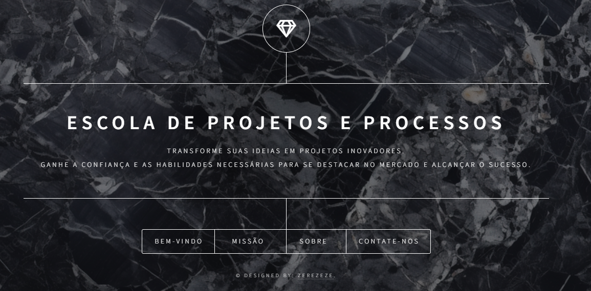

## ESCOLA DE PROJETOS E PROCESSOS

Bem-vindo ao repositório do Projeto da Escola de Projetos e Processos!

## Descrição do Projeto

O Site da Escola de Projetos e Processos foi desenvolvido para uma instituição dedicada à formação de profissionais no gerenciamento e execução de projetos e processos. Este site tem como objetivo fornecer uma plataforma informativa e acessível sobre os cursos, workshops e eventos oferecidos pela escola.

## Tecnologias Utilizadas

HTML: Estrutura o conteúdo do site de forma semântica e acessível.
CSS: Estiliza o site para torná-lo visualmente atraente.
Sass: Utilizado para escrever CSS de forma mais eficiente e modular.
JavaScript: Adiciona interatividade ao site, melhorando a experiência do usuário.

## Sobre o Projeto

O Site da Escola de Projetos e Processos foi desenvolvido com o propósito de servir como um portal completo para a Escola de Projetos e Processos. Este site tem como objetivo principal fornecer informações detalhadas e atualizadas sobre os diversos cursos e programas oferecidos pela escola, além de manter a comunidade de alunos e profissionais informada sobre workshops, eventos e recursos disponíveis.

## Visite o Site
Confira o site através do link: https://zerezeze.github.io/Escola-de-Projetos-e-Processos/

## Contato
Para mais informações sobre o projeto ou para discutir futuras colaborações, envie um e-mail para joseevertonmotarodrigues@gmail.com

Obrigado por visitar o repositório da Escola de Projetos e Processos !

